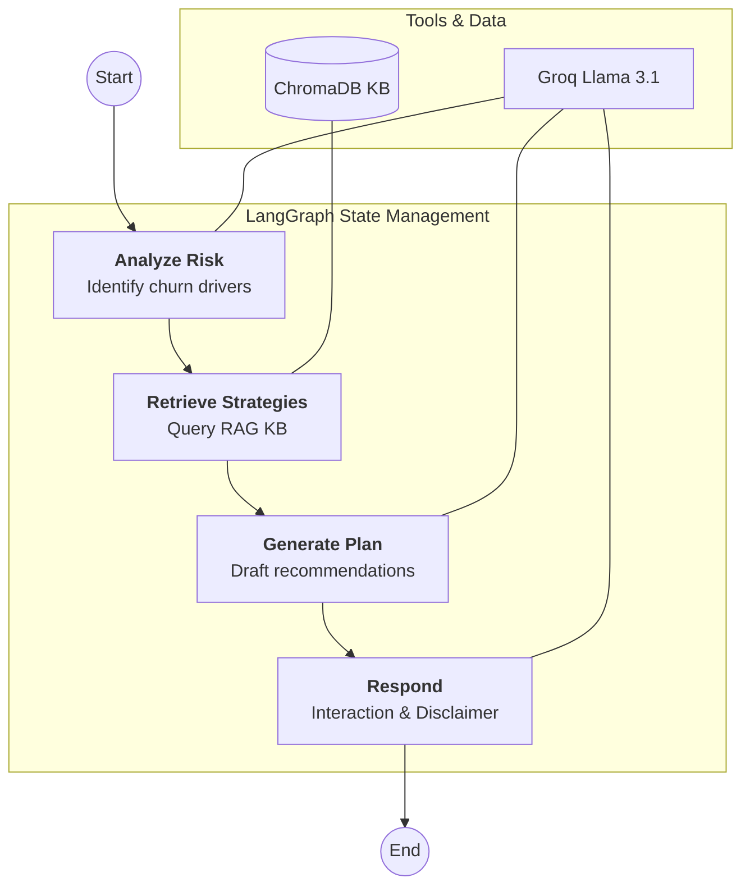

# ChurnGuard AI 🛡️

**Customer Churn Prediction & Agentic AI Retention Strategy Assistant**

ChurnGuard AI is an AI-powered customer analytics system that predicts customer churn and evolves into an agentic AI retention strategist. It uses machine learning to identify at-risk customers and an autonomous AI agent to generate personalized retention strategies.

## Project Overview

- **Milestone 1 (ML Pipeline):** Classical machine learning techniques to predict churn risk using historical customer data (Logistic Regression, Decision Trees).
- **Milestone 2 (Agentic AI):** An agent-based AI application that autonomously reasons about churn risk, retrieves retention best practices via RAG, plans intervention strategies, and generates structured recommendations.

## Project Structure

```text
GenAI/
├── app.py                          # Streamlit dashboard (4-tab UI)
├── .env                            # Groq API key (gitignored)
├── requirements.txt                # Python dependencies
├── data/
│   ├── WA_Fn-UseC_-Telco-Customer-Churn.csv   # Raw dataset (7,043 customers)
│   └── knowledge_base/             # RAG knowledge base
│       ├── retention_strategies.txt
│       ├── service_retention.txt
│       ├── cs_best_practices.txt
│       └── churn_patterns.txt
├── src/
│   ├── preprocess.py               # Data cleaning, encoding, scaling
│   ├── train.py                    # Model training (LR, DT, GridSearchCV)
│   ├── evaluate.py                 # Evaluation & visualization
│   ├── agent/
│   │   ├── state.py                # LangGraph state schema
│   │   └── graph.py                # LangGraph workflow (4 nodes)
│   ├── rag/
│   │   └── vector_store.py         # ChromaDB + HuggingFace embeddings
│   └── extensions/
│       └── pdf_export.py           # PDF retention report generator
├── notebooks/
│   ├── Analysis.ipynb              # EDA notebook
│   └── models/                     # Trained .pkl models & scalers
├── results/
│   └── metrics.json                # Model evaluation metrics
└── reports/                        # Confusion matrices & ROC curves
```

## Features

### Milestone 1 — ML-Based Churn Prediction
- **Interactive Dashboard**: Premium Streamlit UI for customer profiling.
- **Data Preprocessing**: Handles missing values, one-hot encoding, and feature scaling.
- **Machine Learning Models**:
  - Logistic Regression with GridSearchCV hyperparameter tuning.
  - Decision Tree Classifier for model interpretability.
- **Evaluation**: Accuracy, Precision, Recall, F1-Score, Confusion Matrices, ROC-AUC curves.

### Milestone 2 — Agentic AI Retention Strategist
- **LangGraph Agent**: Autonomous 4-node workflow (Analyze → Retrieve → Plan → Respond).
- **Workflow Visualization**:

- **Groq LLM Integration**: Powered by `llama-3.1-8b-instant` via free-tier Groq API.
- **RAG (Retrieval-Augmented Generation)**: ChromaDB vector store with HuggingFace `all-MiniLM-L6-v2` embeddings, loaded with telecom retention best practices.
- **Structured Output**: Risk Summary, Retention Recommendations, Sources, and Ethical Disclaimer.
- **Conversational Interface**: Interactive chat for customer service agents to ask follow-up questions.
- **PDF Export**: Downloadable "Retention Action Plan" reports.
- **Session Memory**: Maintains context across interactions using LangGraph checkpointers.

## Technology Stack

| Component | Technology |
|-----------|-----------|
| ML Models | Scikit-Learn (Logistic Regression, Decision Trees) |
| Agent Framework | LangGraph |
| LLM | Groq (Llama 3.1) |
| RAG | ChromaDB + HuggingFace Embeddings |
| UI | Streamlit |
| PDF Export | fpdf2 |

## Installation

1. Clone this repository:
   ```bash
   git clone https://github.com/TechySuryansh/GenAI.git
   cd GenAI
   ```

2. Create a virtual environment and install dependencies:
   ```bash
   python -m venv .venv
   source .venv/bin/activate
   pip install -r requirements.txt
   ```

3. Create a `.env` file with your Groq API key:
   ```bash
   echo "GROQ_API_KEY=your_groq_api_key_here" > .env
   ```

4. Ingest the RAG knowledge base:
   ```bash
   python src/rag/vector_store.py
   ```

## Usage

### Launch the Application
```bash
streamlit run app.py
```

### How to Use
1. **🎯 Predict Churn** — Fill in a customer profile and click "Predict Churn & Analyze" to get the ML prediction.
2. **🤖 AI Retention Strategy** — Click "Generate AI Retention Strategy" to have the agent autonomously create a retention plan.
3. **💬 Chat with Agent** — Ask follow-up questions about the customer or retention strategies.
4. **📈 Model Performance** — View confusion matrices, ROC curves, and model comparison.
5. **📥 Download PDF** — Export the AI-generated retention plan as a PDF report.

### (Optional) Retrain Models
```bash
cd src && python train.py
python evaluate.py
```

## License
This project is for academic purposes.
